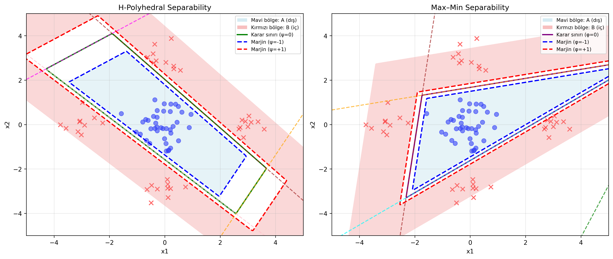

# ENM 612 — Matematiksel Programlama ile Veri Madenciliği Take-Home Ara Sınav Cevapları
## 1- H-Polyhedral ve Max–Min Separability

### Ortak Notasyon

- Veriler iki sınıf:
  - $A = \{a_i\}_{i=1}^m \subset \mathbb{R}^2$
  - $B = \{b_\ell\}_{\ell=1}^k \subset \mathbb{R}^2$
- $h$ adet doğrusal fonksiyon: $\{(w_j, \gamma_j)\}_{j=1}^h$
- Pozitif kısım: $[x]_+ = \max(0, x)$
- Marjin: $\pm 1$ alınır.

---

### H-Polyhedral Separability (Astorino & Gaudioso, 2002)

**Karar fonksiyonu (tek konveks çokyüz):**
$$
\psi(x) = \max_{1 \leq j \leq h} \{ \langle w_j, x \rangle - \gamma_j \}
$$

**Marjinli ayrılma:**
$$
\psi(a_i) \leq -1 \quad (\forall a_i \in A), \qquad \min_j \{ -\langle w_j, b_\ell \rangle + \gamma_j \} \geq 1 \quad (\forall b_\ell \in B)
$$

**Nokta-başı hatalar:**
$$
\varepsilon_A(a_i) = \max_j [ \langle w_j, a_i \rangle - \gamma_j + 1 ]_+ \qquad
\varepsilon_B(b_\ell) = [ \min_j ( -\langle w_j, b_\ell \rangle + \gamma_j + 1 ) ]_+
$$

**Ortalama loss:**
$$
z_{\text{H-Poly}} = \frac{1}{m} \sum_{i=1}^m \max_j [ \langle w_j, a_i \rangle - \gamma_j + 1 ]_+ + \frac{1}{k} \sum_{\ell=1}^k [ \min_j ( -\langle w_j, b_\ell \rangle + \gamma_j + 1 ) ]_+
$$

---

### Max–Min Separability (Bagirov, 2005)

- Hiperdüzlemleri gruplara ayır: $J = \bigcup_{i=1}^r J_i$ (gruplar ayrık)

**Karar fonksiyonu:**
$$
\phi(x) = \max_{1 \leq i \leq r} \min_{j \in J_i} \{ \langle w_j, x \rangle - \gamma_j \}
$$

**Marjinli ayrılma:**
$$
\phi(a_i) \leq -1 \quad (\forall a_i \in A), \qquad \phi(b_\ell) \geq +1 \quad (\forall b_\ell \in B)
$$

**Nokta-başı hatalar:**
$$
\varepsilon_A(a_i) = [ \max_i \min_{j \in J_i} ( \langle w_j, a_i \rangle - \gamma_j + 1 ) ]_+ \qquad
\varepsilon_B(b_\ell) = [ \min_i \max_{j \in J_i} ( -\langle w_j, b_\ell \rangle + \gamma_j + 1 ) ]_+
$$

**Ortalama loss:**
$$
z_{\text{Max-Min}} = \frac{1}{m} \sum_{i=1}^m [ \max_{i'} \min_{j \in J_{i'}} ( \langle w_j, a_i \rangle - \gamma_j + 1 ) ]_+ + \frac{1}{k} \sum_{\ell=1}^k [ \min_{i'} \max_{j \in J_{i'}} ( -\langle w_j, b_\ell \rangle + \gamma_j + 1 ) ]_+
$$

---

H-Polyhedral verideki bir sınıfın tek parçalı ve konveks olduğu durumlarda etkiliyken, Max-Min yöntemi daha karmaşık, iç içe geçmiş ya da birbirinden ayrı yerlerde kümelenmiş olan sınıflar için daha etkilidir. Max-Min yerel yapıları daha iyi ayrıştırabileceğinden, aşırı uyum (overfitting) durumuna neden olabilir. Bu nedenle daha genelleyici sonuçlar için H-Polyhedral daha uygun olabilir. Model karmaşıklığında H-Polyhedral için yüzey sayısını bulmak gerekirken, Max-Min için hem yüzey sayısı hem de grup sayısı bulunması gerekmektedir. Özetle, karmaşık olmayan yapılar için H-Polyhedral ile hızlı bir çözüm bulunabilir ancak daha karmaşık yapılarda Max-Min yöntemi daha etkili olabilir.

## 2- PCF (Polyhedral Conic Functions) ve Modified PCF Algoritması

### Polyhedral Conic Functions (PCF) Nedir?

**PCF Tanımı:** Bir $g: \mathbb{R}^n \to \mathbb{R}$ fonksiyonu aşağıdaki forma sahipse **polyhedral conic function (PCF)** olarak adlandırılır:

$$
g(w,\xi,\gamma,a)(x) = w^\top(x - a) + \xi \|x - a\|_1 - \gamma
$$

Burada:
- $w, a \in \mathbb{R}^n$ (ağırlık vektörü ve tepe noktası)
- $\xi, \gamma \in \mathbb{R}$ (skaler parametreler)
- $\|x - a\|_1 = |x_1 - a_1| + \cdots + |x_n - a_n|$ ($\ell_1$-norm)

**Geometrik Yorum:**
- Fonksiyonun grafiği $(a, -\gamma)$ noktasında tepe noktası olan bir **konik yüzey** (polyhedral cone) oluşturur.
- Sublevel setleri $S_\alpha = \{x : g(x) \leq \alpha\}$ birer **konveks çokyüzlü** (polyhedron) yapıdadır.
- $\gamma \geq 1$ kısıtı ile koni tepesi $z = 0$ düzleminin altına yerleştirilir.

---

### PCF Algoritmasının Temel Prensibi

**Amaç:** İki ayrık nokta kümesi $A = \{a_i\}_{i=1}^m$ ve $B = \{b_j\}_{j=1}^p$ arasında **katı ayrıştırma** (strict separation) yapmak:

$$
g(a) < 0, \quad \forall a \in A \qquad \text{ve} \qquad g(b) > 0, \quad \forall b \in B
$$

**Algoritmanın İşleyişi:**

Her iterasyonda bir **lineer programlama (LP)** problemi çözülür:

$$
\begin{aligned}
\min \quad & \mathbf{e}^\top \mathbf{y} \\
\text{s.t.} \quad & w^\top(a_i - a^l) + \xi \|a_i - a^l\|_1 - \gamma + 1 \leq y_i, \quad \forall i \in I^l \\
& -w^\top(b_j - a^l) - \xi \|b_j - a^l\|_1 + \gamma + 1 \leq 0, \quad \forall j \in J \\
& \mathbf{y} \geq 0, \quad w \in \mathbb{R}^n, \quad \xi \in \mathbb{R}, \quad \gamma \geq 1
\end{aligned}
$$

Burada:
- $a^l \in A^l$: O iterasyonda $A$ kümesinden seçilen bir referans nokta
- İlk kısıt: $A^l$ kümesindeki noktaların mümkün olduğunca $g^l(x) \leq -1$ bölgesine yerleştirilmesi
- İkinci kısıt: $B$ kümesindeki tüm noktaların $g^l(x) > 1$ bölgesinde kalması
- Amaç fonksiyonu: $A^l$ kümesinden mümkün olduğunca çok noktanın ayrıştırılması (hata toplamı minimize edilir)

Her iterasyonda:
1. $g^l(x)$ fonksiyonu oluşturulur
2. $A^l$ kümesinden ayrıştırılan noktalar çıkarılır: $A^{l+1} = \{a_i \in A^l : g^l(a_i) + 1 > 0\}$
3. $A^{l+1} = \emptyset$ olana kadar devam edilir

Sonuç: Final ayrıştırma fonksiyonu tüm iterasyonlardaki fonksiyonların minimum'u olarak elde edilir:

$$
g(x) = \min_{l=1,\ldots,L} g^l(x)
$$

---

### PCF'in Klasik Doğrusal Ayırma Yöntemlerinden Farkları

| **Özellik** | **Klasik Doğrusal Ayırma (SVM vb.)** | **PCF Ayrıştırma** |
|-------------|--------------------------------------|-------------------|
| **Karar Sınırı** | Tek bir hiper-düzlem: $w^\top x = \gamma$ | Birden fazla PCF'in minimum'u: min-max yapı |
| **Ayrılabilirlik** | Sadece doğrusal ayrılabilir veya kernel ile | Lineer ayrılamayan yapıları **doğrudan** ayırabilir |
| **Geometri** | Düz hiper-düzlem | **Konik yüzeyler** ve çokyüzlü yapılar |
| **Esneklik** | Düşük (tek düzlem) | Yüksek (her iterasyon yeni bölge ekler) |
| **Optimizasyon** | Convex QP (quadratic programming) | **Lineer programlama (LP)** - daha basit |
| **Marjin Yapısı** | İki taraflı simetrik marjin | Asimetrik marjin: $g(a) < 0$ ve $g(b) > 0$ |
| **Konveks Olmayan Yapılar** | Kernel trick gerekir | **Doğrudan** mod eder (sublevel setler konveks, birleşim değil) |

**Özetle:**
- **Klasik yöntemler** tek bir düzlem ile ayırır, lineer olmayan yapılarda kernel kullanmalıdır.
- **PCF** birden fazla konik fonksiyonun birleşimi ile **doğrudan** karmaşık yapıları modelleyebilir, optimizasyon LP olduğu için daha hızlı çözülebilir.
- PCF'in sublevel setleri **konveks çokyüzlüdür**, bu da optimizasyon avantajı sağlar.

---

### Modified PCF Algoritması

*Orijinal PCF'in Sınırlaması:*
- Her iterasyonda referans nokta $a^l \in A^l$ rastgele seçilir
- Bu seçim iterasyon sayısını ve ayrıştırma kalitesini doğrudan etkiler
- Koni tepe noktasının konumu $(a^l, -\gamma^l)$ optimal olmayabilir

*Modifikasyonun Amacı:*
Referans nokta $a^l$'yi optimal şekilde seçerek:
- İterasyon sayısını azaltmak
- Ayrıştırma kalitesini artırmak

*Modified PCF'in İşleyişi:*

Her iterasyon $l$'de, $A^l$ kümesindeki her nokta $a_i^l$ için:

1. LP problemini çöz ve $B$'den kaç noktanın ayrıştığını say: $\ell_i$
2. En fazla noktayı ayıran referans noktayı seç:
   $$
   a^l = a^{l_0} \quad \text{burada} \quad l_0 = \arg\max_{i \in I^l} \ell_i
   $$

**Matematiksel Formülasyon:**

$A^l$ kümesindeki her $a_i^l$ için aşağıdaki LP çözülür:

$$
\begin{aligned}
\min_{w,\xi,\gamma,\mathbf{y}} \quad & \mathbf{e}^\top \mathbf{y} \\
\text{s.t.} \quad & w^\top(a_k - a_i^l) + \xi \|a_k - a_i^l\|_1 - \gamma + 1 \leq y_k, \quad \forall a_k \in A^l \\
& -w^\top(b_j - a_i^l) - \xi \|b_j - a_i^l\|_1 + \gamma + 1 \leq 0, \quad \forall b_j \in B \\
& \mathbf{y} \geq 0, \quad w \in \mathbb{R}^n, \quad \xi \in \mathbb{R}, \quad \gamma \geq 1
\end{aligned}
$$

Her çözümden elde edilen $\ell_i = |\{a_k \in A^l : g_i(a_k) \leq -1\}|$ (ayrıştırılan nokta sayısı) hesaplanır.

*Avantajları:*
- *Daha hızlı yakınsama*: En iyi koni pozisyonu seçilir
- *Daha az iterasyon*: Her adımda maksimum sayıda nokta ayrıştırılır
- *Daha iyi kalite*: Optimal tepe noktası konumu

*Dezavantajları:*
- *Hesaplama maliyeti*: $|A^l|$ kez LP çözülmeli (küçük veri setleri için uygun)
- *Büyük veri setlerinde yavaş*: $m$ büyükse her iterasyon pahalı

*Ne Kullanılmalı?*
- Veri seti küçük-orta boyutta ise ($m < 1000$ gibi)
- Ayrıştırma kalitesi kritik ise
- İterasyon sayısını minimize etmek önemliyse

*Alternatif Yaklaşım (Tam Optimal):*
Referans nokta $a^l$'yi de karar değişkeni yapıp tek bir nonlinear optimizasyon problemi çözmek mümkündür, ancak bu LP'nin avantajını kaybettirir.

### Deneysel Sonuçlar: PCF vs Modified PCF

Gasimov ve Ozturk (2006) çalışmalarında, PCF ve Modified PCF algoritmalarını 6 farklı UCI veri seti üzerinde 10-kat çapraz doğrulama ile karşılaştırmışlardır.

Modified PCF, WBCD hariç tüm veri setlerinde test doğruluğunu artırmıştır.
En büyük artış WBCP’de (+10.44 puan), ardından Heart (+9.77), Liver (+9.57), Diabetes (+8.99) ve Ionosphere (+7.70) gelmektedir.
Ortalama LP sayısı belirgin şekilde azalmıştır (özellikle Heart: 74→27, −%64); bu da toplam süreyi genel olarak düşürür.
Özetle: Daha yüksek test doğruluğu ve daha düşük toplam zaman; her iterasyon daha pahalı olsa da toplam iterasyon sayısı azaldığı için süre avantajı sağlanır.

---

### Referanslar

- Astorino, A., & Gaudioso, M. (2002). Polyhedral separability through successive LP. Journal of Optimization Theory and Applications, 112(2), 265–293. https://link.springer.com/article/10.1023/A:1013649822153
- Bagirov, A. M. (2005). Max–Min separability. Optimization Methods and Software, 20(2–3), 277–296. https://doi.org/10.1080/10556780512331318263
- Ceylan, G., & Öztürk, G. (2020). Revised polyhedral conic functions algorithm for supervised classification. Turkish Journal of Electrical Engineering and Computer Sciences, 28(5), 2735–2749. https://doi.org/10.3906/elk-2001-62
- Gasimov, R. N., & Öztürk, G. (2006). Separation via polyhedral conic functions. Optimization Methods and Software, 21(3), 527–540. https://doi.org/10.1080/10556780600723252
